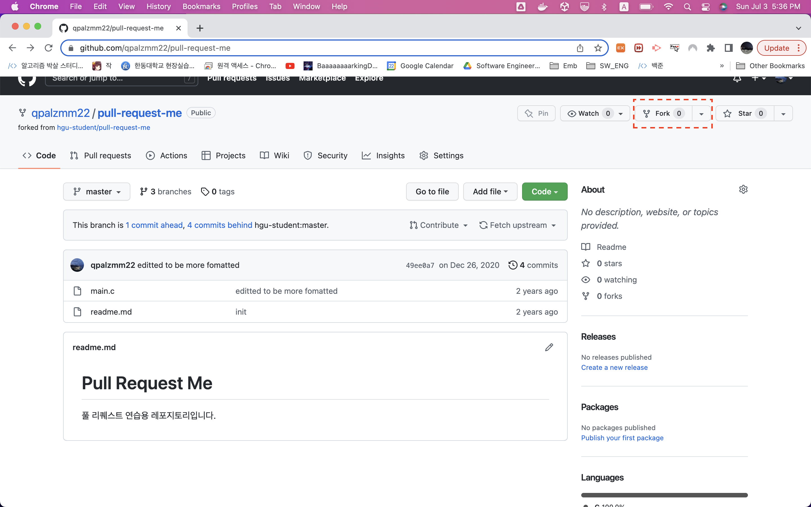
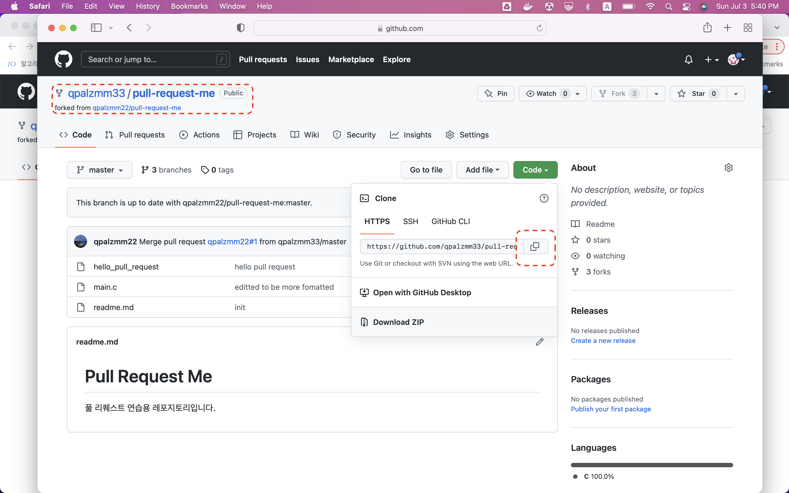
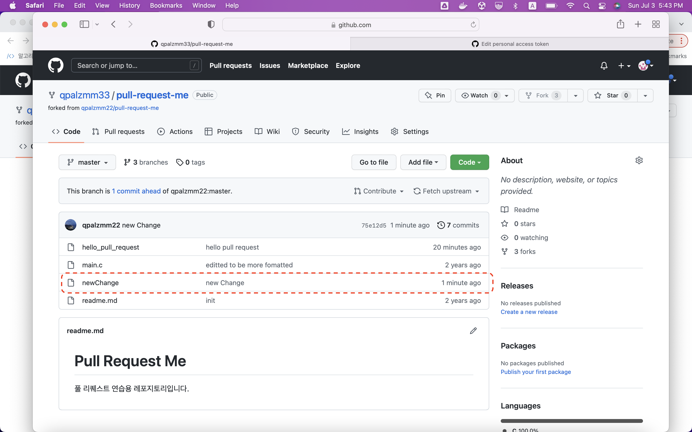
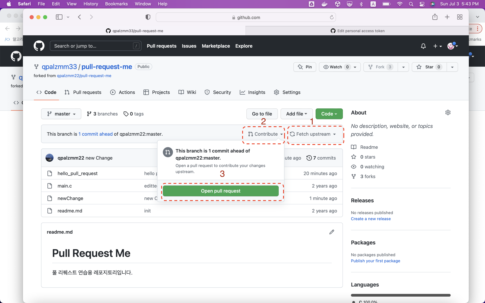

# Day 1

## Abstraction

20년도 이전에만 해도 이 과목은 `Linux Baics`를 배우던 과목이었습니다. 하지만 ~~살아있는 레전드~~ 한찬솔 선배님이 MIT에서 진행한 `Missing Semester`를 보고 프로그래머라면 매우 유용한 정보를 꽉꽉 담은 과목으로 만들었습니다.

이 과목으로 우리는 `Linux`의 기본적인 개념과 더불어 프로그래머로써 꼭 필요한 도구들을 **잘** 다루는 방법들을 배웁니다.

`주교제 1`은 `Ubuntu` 텍스트 북입니다. 밑의 `주교제2`에서 설명하는 것 처럼 다 이해를 못 하시더라도 이런게 있구나 하시고 넘어가셔도 됩니다. 그래도 한번씩 실행시켜보시고 나중에 이런게 있었지 라고 기억하실 정도로만 일단 아셔도 됩니다. 


[주교제 2 : Programmer Base(ccss)](https://ccss17.netlify.app/programmerbase/)

> 저희가 한 주동안 가장 많이 참조할 블로그입니다. 정말 깔끔하게 잘 설명되있지 않나요?

[참조 1: Missing Semester](https://mishttps://gitlab.com/gitlab-org/security-products/analyzers/fuzzers/pythonfuzz/-/merge_requests/13sing.csail.mit.edu/)

> 저희가 배우는 내용 외에도 `metaprogramming`, `sed` 나 `awk` 같은 `data wragling` 등 재미있는 주제들이 많으니 참조하세요.

[참조 2: Linux Commands](https://linuxcommand.org/tlcl.php)

> `주교제1` 외에 linux 에 대한 내용이 담겨있는 digital book 입니다.

### 한 주 동안 배우는 내용
- Linux commands
- Git
- Docker
- VScode extensions
- Vim
- Tmux, zsh, markdown


## 실습방법

여러분들이 과제하고 코딩하는 환경은 다 다릅니다. 누구는 윈도우를 누구는 맥을 쓰고 있겠죠. 각각의 환경에서 `Linux`를 구동시키기 위해서 사용하는 방법은 다양하겠지만 저희는 [도커](#-docker-설치)를 사용해서 `Linux utility` 들을 사용해보도록 하겠습니다.

## Docker 설치

아래의 링크 타셔서 그대로 따라해주세요. `docker container` 내에서 실습하시면 됩니다.

https://ccss17.netlify.app/programmerbase/01-day1/readme/ 

## 과제

1. 교재 읽고 따라해보기 ch.1 ~ ch.2
2. Docker 로 container 다운로드 및 `nyancat` 실행해보기 (`ctrl + c` 로 빠져나올 수 있습니다.)
    ```sh
    $ nyancat


3. https://ccss17.netlify.app/programmerbase/01-day1/readme/ 읽고 따라하기
4. (Extra) Docker 이미지를 만드는 Dockerfile에 대해서 공부해보고 본인만의 Docker image를 만들어서 `docker hub`에 올려보세요~! 

# Day 2

[주교제2 (Day2)](https://ccss17.netlify.app/programmerbase/02-day2/readme/) <= 읽어주세요

## VSCode, Git, Markdown

- Git, VSCode 설문조사
- `Git` 이란? "프로젝트의 버전을 손쉽게 다룰 수 있게 해주는 시스템, `Version Control System(VCS)`이다"

- [VCS 란?](https://git-scm.com/book/ko/v2/%EC%8B%9C%EC%9E%91%ED%95%98%EA%B8%B0-%EB%B2%84%EC%A0%84-%EA%B4%80%EB%A6%AC%EB%9E%80%3F)

> VCS를 사용하면 각 파일을 이전 상태로 되돌릴 수 있고, 프로젝트를 통째로 이전 상태로 되돌릴 수 있고, 시간에 따라 수정 내용을 비교해 볼 수 있고, 누가 문제를 일으켰는지도 추적할 수 있고, 누가 언제 만들어낸 이슈인지도 알 수 있다. VCS를 사용하면 파일을 잃어버리거나 잘못 고쳤을 때도 쉽게 복구할 수 있다. 이런 모든 장점을 큰 노력없이 이용할 수 있다.

- [그래서 버전관리를 어떻게 하는데?](https://git-scm.com/boo2k/ko/v2/%EC%8B%9C%EC%9E%91%ED%95%98%EA%B8%B0-Git-%EA%B8%B0%EC%B4%88)

- 델타 기반 버전 관리 (기존방법)


- 왜 이런 방법을 썼을까? 
=> Too heavy to store whole data

- Stream of Snapshot (git)


### Git 의 파일 관리 방법

- Untracked 상태 : git 이 변경사항을 추적하지 않는 파일이다.
- Tracked 상태 : git 이 변경사항을 추적하는 파일이다.
    - Unmodified(Committed) 상태 : 파일을 추적하지만 아직 변경이 되지 않은 상태이다.    
    - Modified 상태 : 파일을 변경했지만 아직 스테이징되지 않은 상태이다.
    - Staged 상태 : 변경된 파일을 커밋이 될 리스트에 포함시킨 상태이다.


### How to Pull Request
1. `github`에 있는 해당 주소를 본인 `github`로 `fork` 합니다.
    
2. fork 한 프로젝트를 현재 컴퓨터에서 작업하기 위해서 clone 합니다.
    
3. 작업(수졍)을 하고 commit을 합니다.
4. push를 합니다.
    
5. fetch 를 한 후 pull request를 날립니다.
     

## 과제
1. 교재 읽고 따라해보기 ch.3 ~ ch.4
2. https://github.com/qpalzmm22/GBC33_ProgrammerBase.git fork하고 본인 이름 directory 안에 `hw2.md` 만들고 https://ccss17.netlify.app/programmerbase/02-day2/hw2/에 나와있는 과제 중 1를 조사하여 `hw2.md`에 이것 작성해서 본인 repository 에 push 한 후 qpalzmm22/GBC33_ProgrammerBase 에 `pull request` 하기

# Day 3

## Vim, Tmux

### Vim 3가지 모드


### Vim Extra 유용한 Command

| Command |설명|
|--|--|
|`:help`| 설명 및 도움말 |
|`ctrl` + `shift` + `a` | 1 증가 |
|`ctrl` + `shift` + `x` | 1 감소 | 
|`:e [filename]` | 파일 열기 |
|`fg` | 커서 위치의 파일 열기 |
|`ctrl` + `^` | open previous file|


https://ccss17.netlify.app/programmerbase/03-day3/readme/

## 과제
1. 교재 읽고 따라해보기 ch.5 ~~ch. 6, ch.7~~ ch. 7.2 
2. https://ccss17.netlify.app/programmerbase/03-day3/readme/ `vim`, `tmux` 읽기
3. 100줄 가량의 프로그램 `vim`, `tmux` 사용해 짜기 (가령 백준 실버 문제) https://www.acmicpc.net/problemset 를 풀기
4. 풀면서 사용한 새로운 `vim` 혹은 `tmux` command를 간략하게 소개하기 

# Day 4

## configs 
- upgrade cli : https://ccss17.netlify.app/programmerbase/cli/#cli

## 과제
1. 교재 읽고 따라해보기 ch. 8(부분적), ch. 9, ch. 10
2. cli upgrade : https://ccss17.netlify.app/programmerbase/cli/#cl
3. https://ccss17.netlify.app/programmerbase/04-day4/hw4/

# Day 5


## 과제