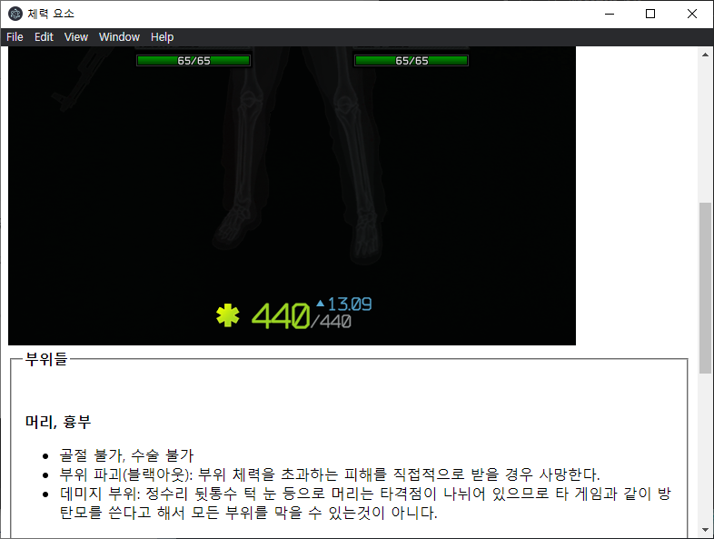

# 가륜이의 HW! "Electron"

## 

JavaScript,HTML,CSS를 이용하여 데스크탑 앱을 만들 수 있도록 도와주는 기술입니다.

 
이 기술은 Chromium과 Node.js를 JavaScript, HTML, CSS와 결합하여 Mac, Linux, Window에서 직접 설치할 수 있는 앱을 만들 수 있도록 도와줍니다.

  

다음 차트는 electron이 상당히 높은 관심도를 보이고 있다는 것을 보여줍니다.(웹 검색)

 

또한 우리가 많이 사용하는 프로그램들 중에서 이 기술을 사용한 것이 상당히 많습니다.

ex) Discord, Skype, Github Desktop, VSCode

 
다음은 제가 electron을 이용하여 만들어본 앱입니다.

[다운로드](https://drive.google.com/file/d/1MX2Kab2b1jPCE2jFSw4HeVVprR07L0Kl/view?usp=sharing)

이것처럼 간단한 HTML을 공부하여 직접 만들면 다양한 정보를 쉽게(?) 찾아볼 수 있도록 할 수 있고, 더 나아가 다양한 기능을 하는 앱을 개발할 수 있습니다.
 
 
 
Electron을 해보고 싶다면 다음 블로그를 참고해 보세요

[>클릭<]()